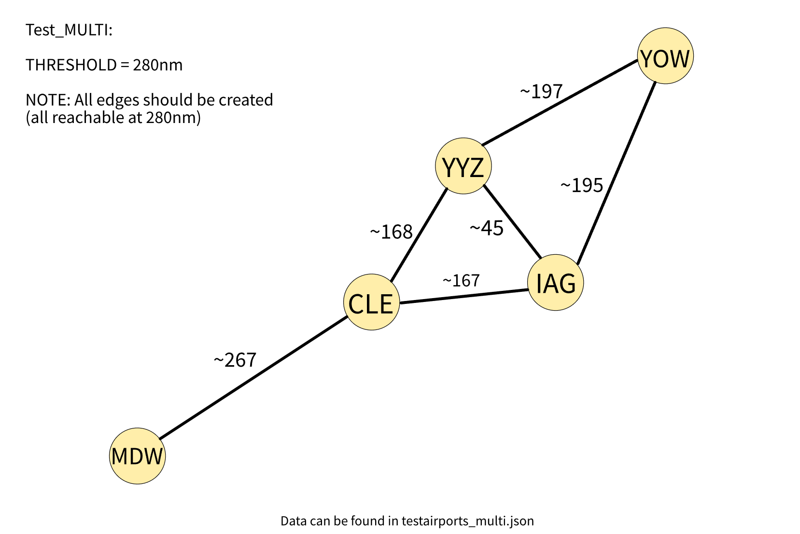
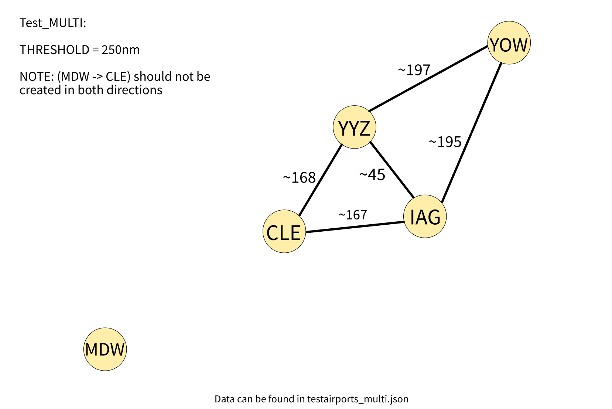
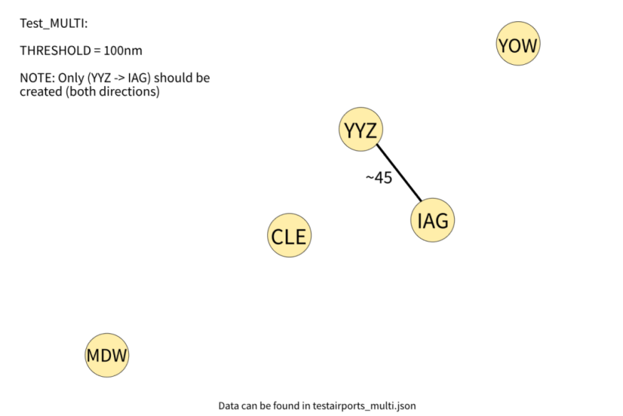
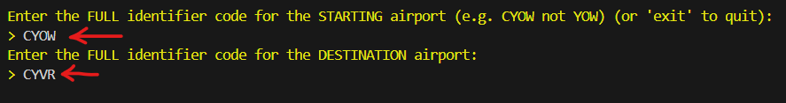
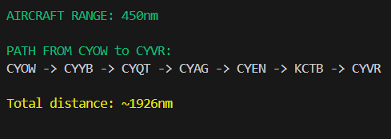

# Flight Path Optimizer

Flight Path Optimizer calculates the shortest route for a limited plane's range using a highly modified version of Dijkstra's algorithm. The program fetches airport data from OurAirports API, calculates the great circle distances (orthodromic distance) between all pairs of airports that fit the given needs, and generates a graph with airports as nodes and requirement matching distances as edges, then outputs the shortest path to the destination of choice.

This Project was made **with the advising of a Licensed Pilot** and the routes are tested to be the most optimal routes without unnecessary stops. It will take into account compromising slightly extra distance, for a few less landings for pilot convenience.

This project uses a modifiable **Threshold** ([see here](#Threshold)) when creating paths representing **the realistic range of the aircraft** to remove any unreachable paths.

For example, while the max range is 650nm, a realistic range for the Cesna 172 is around 400nm , so the program will set a 400nm **threshold** which can be modified if needed.

~~**Change THRESHOLD VARIABLE in flightpathOptimizer.cpp to change the max range** (TO BE CHANGED)~~ 

**THRESHOLD can be changed at the beginning of the program by inputting the aircrafts range when prompted**

## Features

- Fetches Airport location data from OurAirports api
- Parses and filters data using a python script to only include
small, medium, and large airports (no heliports or seaports) and restrict to region of choice
- Calculates the circle distance between all the pairs of airports
using the Haversine formula https://en.wikipedia.org/wiki/Haversine_formula
- Converts calculations into an adjacency list representation of a graph with airports as nodes and **Reachable** distances as the edges
- Using a personally written and modified version of Dijkstra's Algorithm (see summary above for details), finds the optimal path from a given starting airport and destination and outputs it to the user.

# Threshold
### The Threshold sets the maximum distance (in nautical miles) for creating edges between airports in the network graph. This ensures only direct, feasible routes are included.
### Its purpose is to:
- **Limit Edge Creation:** Only connect airports within the specified distance.
- **Optimize Performance:** Reduce graph density for faster pathfinding.
- **Realistic pathing:** Reflect a realistic route that the specified aircraft range can reach.
### For example if your range is 280nm, a graph from sample data would look like this:

### Whereas if your range is 250nm, the path to reach MDW would no longer be possible, resulting in this graph:

### And if for some reason your range is only 100nm...

## Requirements

- Visual C++ Redistributable

- **For source code version compiling**
    - Python3.X
    - Cmake3.10+
    - C++ compiler (GNU was used for this project but others should work if configured).

## Usage
### **NON-UI Source Code Version (Usage through console/terminal)**
It is **not recommended** to use this version if you do not know what you are doing as it is mainly run using a terminal or command prompt (need GNUWin32 on windows)
1. Clone the repository into the desired directory

2. Navigate to the directory and enter "cmake ." into your command prompt or terminal to automatically configure the project based on the premade CMakeLists.txt.

3. After configuration is complete, some new files should be in the directory, **verify that "Makefile" is in the directory**, then enter the command 'make' (without the quotations) into your terminal
4. Run the program using "./flightPathOptimizer" and proceed with the instructions"

5. Allow the fetching script to run automatically to create the data file, then **enter the range of your aircraft after flight conditions considerations**.

6. Enter the **full ICAO** or Identifier code (Which mean include the region identifying letter 'C' for canadian airports, 'K' for US airports, etc.)

7. The code should now run and give you the **optimal and most efficient path** to reach your inputted destination.

### **Non-Graphic UI version**
- To be added

### **Graphic UI version**
- To be added

  

# Changelog
### v1.0.0 - 11 June 2024
- Initial Working Program

### v1.0.1 - 12 June 2024
- **Important Algorithm Change**: Updated the algorithm to check for a direct flight from the current airport after every landing

### v1.0.2 - 12 June 2024
- **Important Algorithm Change**: Updated the algorithm again, and separated it into 2 versions. 

    - Version **findShortestPathMIN()**: Acts the same as in 1.0.1 and attempts to minimize distance while checking for a direct flight after every landing (hop).

    - Version **findShortestPath()**: This version will **sacrifice some distance for the convenience of not having to land as many times**. This version will be the default version used in the program.
    
    ### Here is an example of this (Ottawa to Mexico City)
    #### OLD (MIN version):
    
    Here the total distance is slightly lower, however most people would not want to land this many times to save ~10nm of flying (in the end the landings will waste much more time).
    #### NEW (Default version):
    
    As you can see the total distance is slighly higher, however in the end it is a more efficient path that considers the fact that more stops will waste more fuel anyways.
